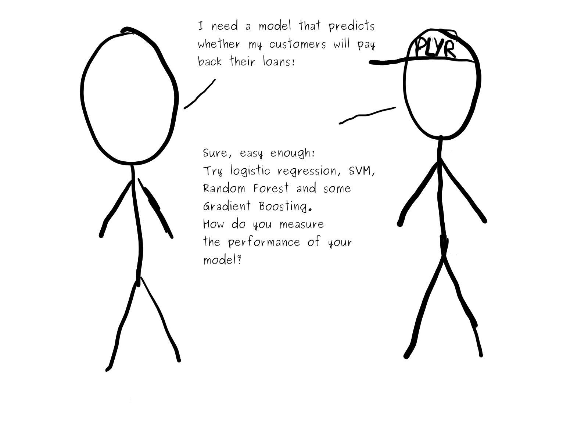
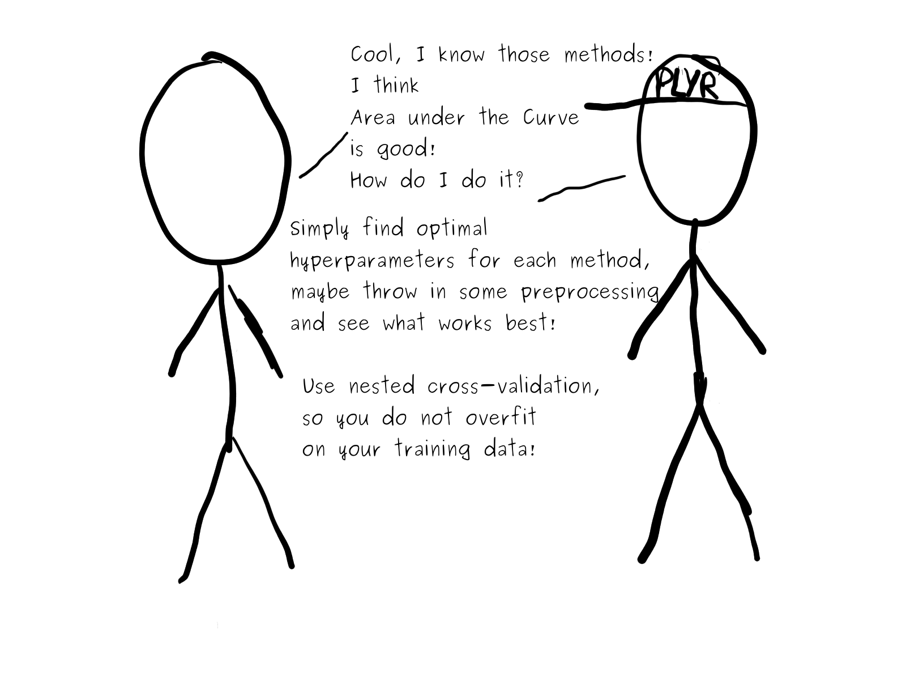
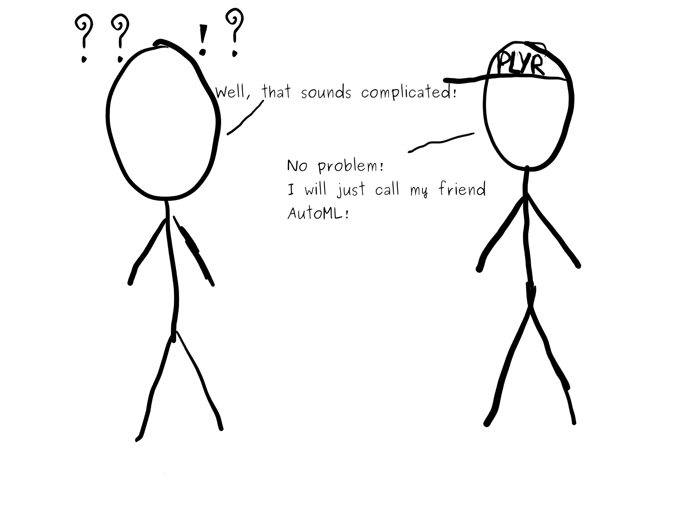
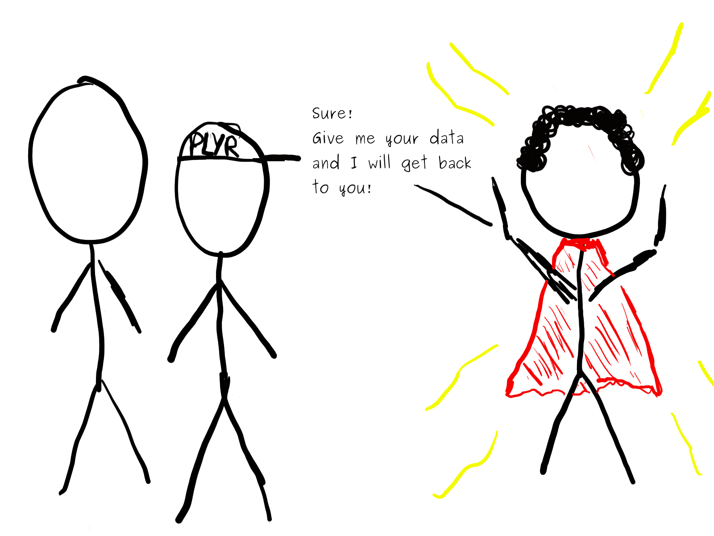
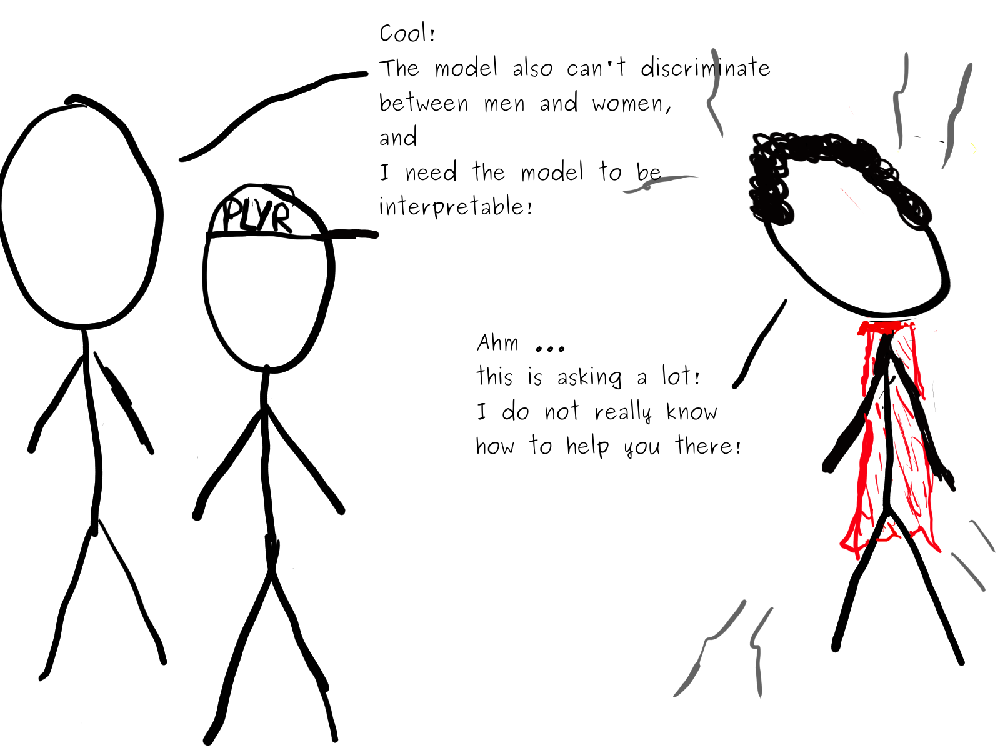
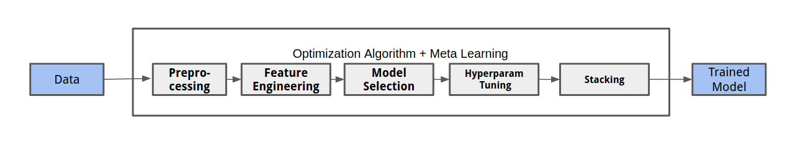
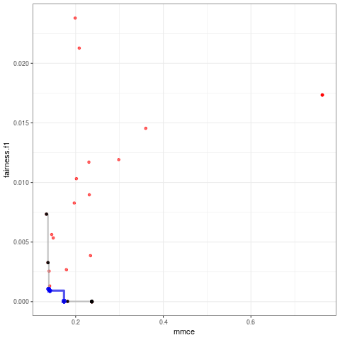
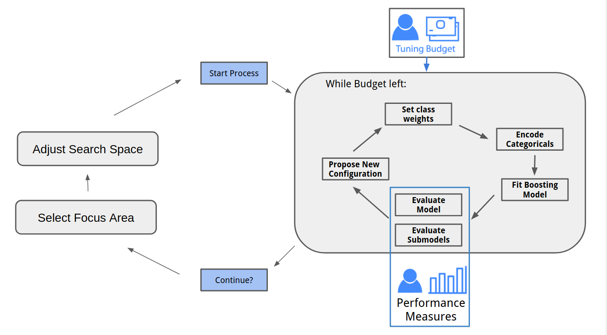
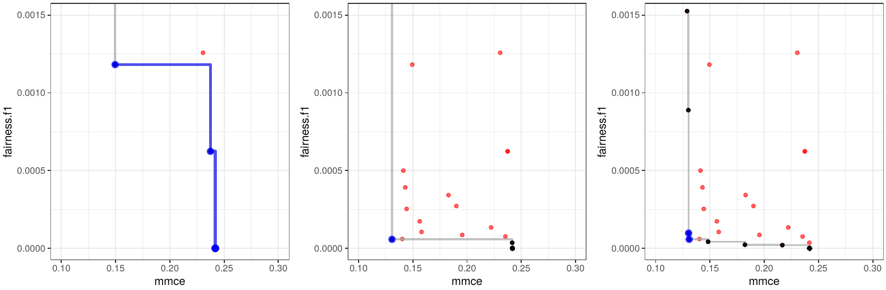
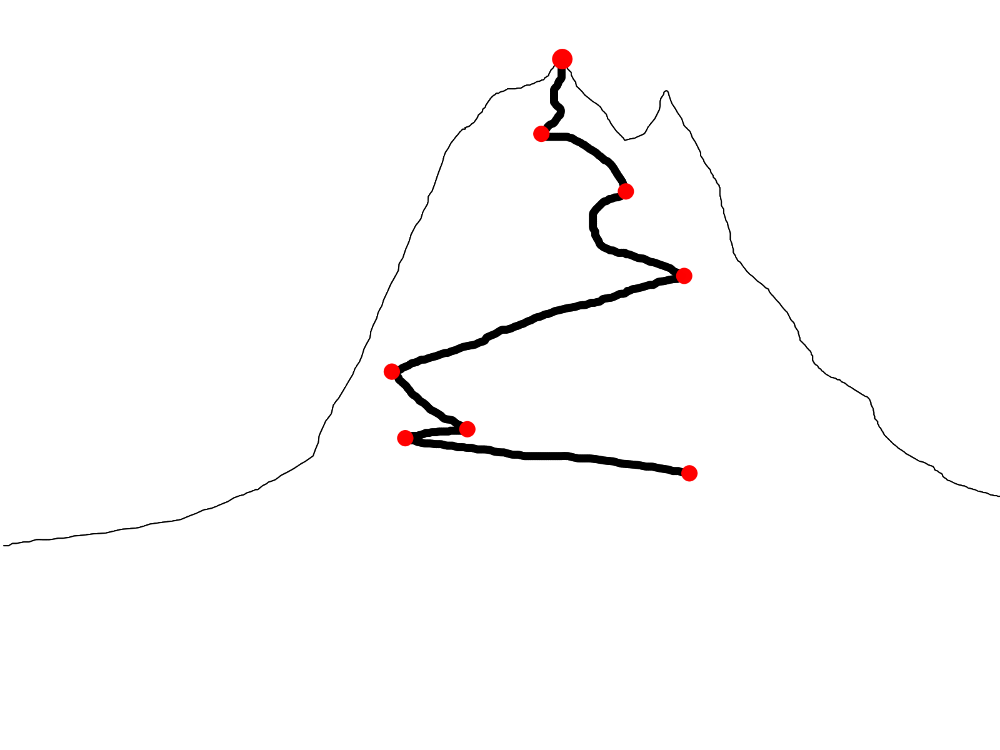

---


---


---


---



---
# A short intro to AutoML

- Automatically obtain an optimal model for a dataset

- Many different flavours exist!

- The system performs model selection, tuning, ...




## Why? 
- Many steps of the typical ML pipeline can be easily automized!
- Computers are efficient in trying out many possibilities
- Efficient search strategies exist!
- Humans are single-threaded and have little RAM!


---
# Multi-Objective AutoML - Why?

- Current AutoML approaches are **very good** at optimizing predictive performance!

- Many applications require models that are *good* with respect to multiple 
  objectives.
  
- **But:** Current AutoML approaches do not really incorporate this!

## Problem:

Users either use AutoML without considering other objectives,
or do everything manually!


---
# Interesting Objectives:

## Fairness

  ... usually means that our model  $f_\theta$ trained on a dataset $X$ and target $y$ does not discriminate 
  between a set of protected attributes $A$, such as ethnicity and gender.
  
  There are many (often conflicting) definitions of fairness, to give two examples:
  
- Equalized Odds (Hardt, 2016)

    $Pr\{\hat{Y} = 1 | A = 0, Y = y\} = Pr\{\hat{Y} = 1 | A = 1, Y = y\}, y \in \{0,1\}$
      
      
- Equal Opportunity (Hardt, 2016)
  
    $Pr\{\hat{Y} = 1 | A = 0, Y = 1\} = Pr\{\hat{Y} = 1 | A = 1, Y = 1\}$
    
    
---
# Interesting Objectives II:

## Interpretability 

  Many post-hoc interpretability methods allow us to understand what our model learns.
  But: They mostly rely on **local** and **linear** explanations.
  
- Main Effect Complexity (Molnar, 2019)

  $\rightarrow$ How well can main effects be approximated by linear segments?
  
- Interaction Strength (Molnar, 2019)

  $\rightarrow$ How much of a model's prediction can **not** be explained by main effects?
  
- Sparsity

  Even simple models with $1000's$ of predictors are hard to grasp
  
---
# Interesting Objectives III:
  
## Robustness

- Robustness to adversarial examples, perturbations , ...
  
## Memory and Inference Time

- Deploying on mobile devices, scoring *http* requests
  
## ...

---
# AutoXgboostMC 

.pull-left[
- We propose a simplified AutoML system in order to explore the setting 

- Uses XGboost models, and a limited amount of preprocessing steps

- Optimize using Multi-Objective Bayesian Optimization

- Human-in-the-loop: 
  - User can stop and restart the process, adjust parameters.
  - User specifies area, the optimization algorithm should focus in.
]


.pull-right[

.small[
**parEgo** (Knowles, ) uses random projections in order to explore the pareto front.
We can limit the range of random projections in order to focus on certain areas.
]
]

---
# Workflow



---
## Pareto Front



  .small[Pareto front for Fairness and MMCE after 20, 70 and 120 iterations.]


- Limit the range of random projections (weights for the measures) in order to focus on specific areas.

- Grey line contains Pareto optimal points

- .blue[Blue segment:] Pareto optimal for weights from $[0.1; 0.9]$ to $[0.9;0.1]$.

---
# Open Challenges

.pull-left[
- **Awareness** for other objectives is often lacking.
  If they are not easily accessible users might just neglect them.

- **Fairness** measures are often not well-defined and highly depend on context

- Measures for **robustness** do not really exist and require more research. 

- Research into **interpretability** measures has just started!

- New pre- and post-processing methods might be required.
]

.pull-right[



- Several tools for multi-criteria optimization already exist, further research might be beneficial.

- Tools to increase **transparency** and **trust** in AutoML systems are important! 
  Human-in-the-loop approaches can help here!

]


---
# Thank you for your attention!

### Check out our progress:

```url
https://github.com/pfistfl/autoxgboostMC
```

### Suggestions, Interesting applications?

```url
florian.pfisterer@stat.uni-muenchen.de
```

---
# References

- Hardt, M., Price, E., Srebro, N., et al. (2016).
  Equality of opportunity in supervised learning. 
  In Advances in neural information processing systems
  
- Molnar, C., Casalicchio, G., and Bischl, B. (2019).
  Quantifying interpretability of arbitrary machine learning models through functional decomposition.
  arXiv preprintarXiv:1904.03867.
  
- Thomas, J., Coors, S., and Bischl, B. (2018).
  Automatic gradient boosting. 
  International Workshop on Automatic Machine Learning at ICML.
  
- Knowles, J. (2006)
  ParEGO: a hybrid algorithm with on-line landscape approximation for expensive multiobjective optimization problems.
  IEEE Transactions on Evolutionary Computation ( Volume: 10 , Issue: 1 , Feb. 2006 )

---
# Constraint vs. Multi-Objective Optimization

- An alternative to our approach would be putting constraints on e.g fairness measures.

  $\rightarrow$ hard constraints (e.g. memory consumption during inference) can be useful
  
  $\rightarrow$ In many cases, users want to choose the trade-off from the offered models.

