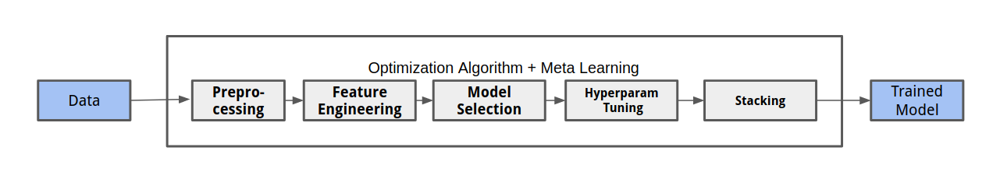
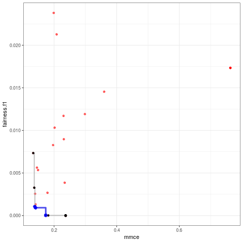
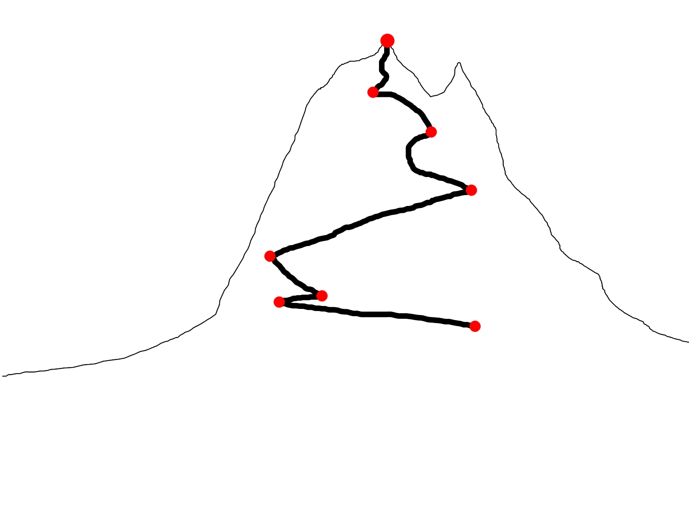

# A short intro to AutoML

```{r setup, include = FALSE}
options(htmltools.dir.version = FALSE)
```

- Automatically obtain an *"optimal"* model for a dataset

- The system performs model selection, tuning, ...

- Many different flavors exist!




## Why?
- Many steps in the typical ML pipeline can be easily automatized!
- Computers are efficient in trying out many possibilities and searching through
  complex spaces.


---
# Multi-Objective AutoML - Why?

- Current AutoML approaches are **very good** at optimizing predictive performance!

-  **But:** Many applications require models that trade of or are *good* with respect to multiple
  objectives.

.pull-left[
## Problem:

Too narrow focus on a single measure for predictive performance!

Users either use AutoML without considering other objectives,
or do analysis manually!
]

.pull-right[

]


---
# Interesting Objectives:

## Fairness

  ... usually means that our model  $f_\theta$ trained on a dataset $X$ and target $y$ does not discriminate
  between a set of protected attributes $A$, such as ethnicity and gender.

  There are many (often conflicting) definitions of fairness, to give two examples:

- Equalized Odds (Hardt, 2016)

    $Pr\{\hat{Y} = 1 | A = 0, Y = y\} = Pr\{\hat{Y} = 1 | A = 1, Y = y\}, y \in \{0,1\}$


- Equal Opportunity (Hardt, 2016)

    $Pr\{\hat{Y} = 1 | A = 0, Y = 1\} = Pr\{\hat{Y} = 1 | A = 1, Y = 1\}$

- Further desideratum: Calibration

---
# Interesting Objectives II:

## Interpretability

  Many post-hoc interpretability methods allow us to understand what our model learns.
  But: They mostly rely on **local** and **linear** explanations.

- Main Effect Complexity (Molnar, 2019)

  $\rightarrow$ How well can main effects be approximated by linear segments?

- Interaction Strength (Molnar, 2019)

  $\rightarrow$ How much of a model's prediction can **not** be explained by main effects?

- Sparsity

  Even simple models with $1000's$ of predictors are hard to grasp

---
# Interesting Objectives III:

## Robustness

- Robustness to adversarial examples, perturbations , distribution shift, ...

## Memory and Inference Time

- Deploying on mobile devices, scoring *http* requests

## ...

---
# Open Challenges

.pull-left[
- **Awareness** for other objectives is often lacking.
  If they are not easily accessible users might just neglect them.

- **Fairness** measures are often not well-defined and highly depend on context

- Measures for **robustness** do not really exist and require more research.

- Research into **interpretability** measures has just started!

- New pre- and post-processing methods might be required.
]

.pull-right[


- Interesting Datasets and Benchmarks are required to compare systems.

- Tools to increase **transparency** and **trust** in AutoML systems are important!
  Human-in-the-loop approaches can help here!
]

---
# References

- Hardt, M., Price, E., Srebro, N., et al. (2016).
  Equality of opportunity in supervised learning.
  In Advances in neural information processing systems

- Molnar, C., Casalicchio, G., and Bischl, B. (2019).
  Quantifying interpretability of arbitrary machine learning models through functional decomposition.
  arXiv preprintarXiv:1904.03867.

- Thomas, J., Coors, S., and Bischl, B. (2018).
  Automatic gradient boosting.
  International Workshop on Automatic Machine Learning at ICML.

- Knowles, J. (2006)
  ParEGO: a hybrid algorithm with on-line landscape approximation for expensive multiobjective optimization problems.
  IEEE Transactions on Evolutionary Computation ( Volume: 10 , Issue: 1 , Feb. 2006 )
  
